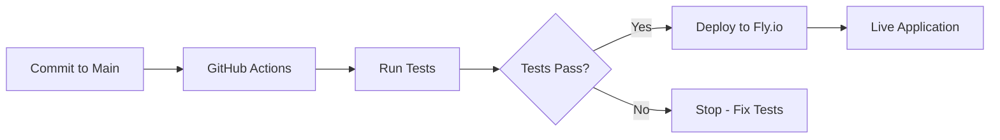

# 🚀 Automatic Deployment Setup Guide

This guide will help you set up automatic deployment to Fly.io every time you commit to your repository.

## 📋 Prerequisites

1. **Fly.io Account**: Sign up at [fly.io](https://fly.io)
2. **GitHub Repository**: Your code should be in a GitHub repository
3. **Fly.io CLI**: Install flyctl locally for initial setup

## 🔧 Step-by-Step Setup

### Step 1: Initial Fly.io Setup

1. **Install Fly.io CLI**:
   ```bash
   # Windows (PowerShell)
   iwr https://fly.io/install.ps1 -useb | iex
   
   # macOS/Linux
   curl -L https://fly.io/install.sh | sh
   ```

2. **Login to Fly.io**:
   ```bash
   flyctl auth login
   ```

3. **Create and deploy your app** (first time only):
   ```bash
   cd your-project-directory
   flyctl launch
   # Follow the prompts to configure your app
   ```

### Step 2: Get Your Fly.io API Token

1. **Generate an API token**:
   ```bash
   flyctl auth token
   ```
   
2. **Copy the token** - you'll need it for GitHub secrets

### Step 3: Configure GitHub Secrets

1. **Go to your GitHub repository**
2. **Navigate to**: Settings → Secrets and variables → Actions
3. **Click "New repository secret"**
4. **Add the following secret**:
   - **Name**: `FLY_API_TOKEN`
   - **Value**: [paste your token from Step 2]

### Step 4: Verify GitHub Actions Workflow

The workflow file `.github/workflows/python-tests.yml` is already configured to:

✅ **Run tests on every push/PR**
✅ **Deploy to Fly.io on successful merge to main**
✅ **Only deploy from main branch**

## 🔄 How It Works

### Workflow Triggers:
- **On Push to Main**: Runs tests → Deploys if tests pass
- **On Pull Request**: Runs tests only (no deployment)

### Deployment Process:
1. **Checkout code** from your repository
2. **Set up Python** environment
3. **Install dependencies** from requirements.txt
4. **Run all tests** to ensure code quality
5. **Deploy to Fly.io** if tests pass (main branch only)

## 📁 Project Structure for Deployment

Ensure your project has these files:

```
├── .github/
│   └── workflows/
│       └── python-tests.yml    # ✅ GitHub Actions workflow
├── app.py                      # ✅ Main Flask application
├── requirements.txt            # ✅ Python dependencies
├── Dockerfile                  # ✅ Container configuration
├── fly.toml                    # ✅ Fly.io app configuration
├── bytecode_interpreter.py    # ✅ Core interpreter
├── bytecode_optimizer.py      # ✅ Code optimizer
├── templates/                  # ✅ HTML templates
└── tests/                      # ✅ Unit tests
```

## 🚀 Deployment Commands

### Manual Deployment (if needed):
```bash
flyctl deploy
```

### Check Deployment Status:
```bash
flyctl status
flyctl logs
```

### Open Your Deployed App:
```bash
flyctl open
```

## 🔍 Monitoring Your Deployments

### GitHub Actions:
1. Go to your repository
2. Click the "Actions" tab
3. View workflow runs and deployment status

### Fly.io Dashboard:
1. Visit [fly.io/dashboard](https://fly.io/dashboard)
2. Monitor your app's health and performance

## ⚙️ Configuration Options

### Environment Variables:
Set production secrets in Fly.io:
```bash
flyctl secrets set SECRET_KEY=your-production-secret-key
flyctl secrets set FLASK_ENV=production
```

### Scaling:
```bash
# Scale memory
flyctl scale memory 1024

# Scale instances
flyctl scale count 2
```

## 🛠️ Troubleshooting

### Common Issues:

1. **Deployment Fails**:
   ```bash
   flyctl logs
   # Check logs for specific errors
   ```

2. **Tests Fail**:
   - Check GitHub Actions logs
   - Run tests locally: `python -m unittest discover -s tests`

3. **Missing Secrets**:
   - Verify `FLY_API_TOKEN` is set in GitHub repository secrets
   - Generate new token: `flyctl auth token`

4. **App Won't Start**:
   ```bash
   flyctl ssh console
   # Debug inside the container
   ```

## 🎯 Benefits of This Setup

✅ **Automatic Testing**: Every commit is tested  
✅ **Safe Deployments**: Only deploys if tests pass  
✅ **Zero Downtime**: Fly.io handles rolling deployments  
✅ **Rollback Capability**: Easy to revert if needed  
✅ **Monitoring**: Built-in health checks and logging  

## 🔄 Workflow Summary



Now every time you commit to the main branch, your bytecode interpreter will automatically deploy to the cloud! 🌐
